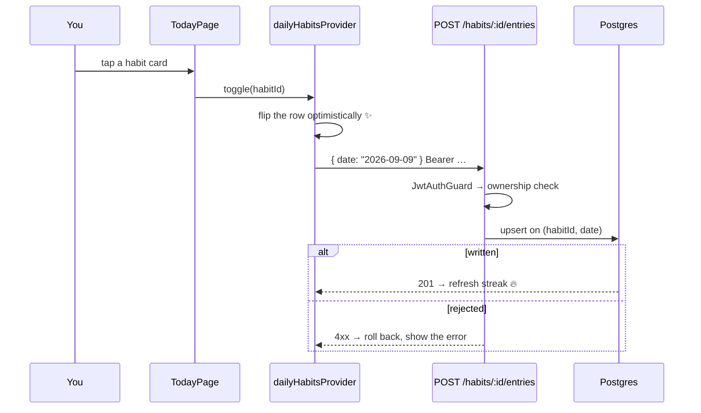
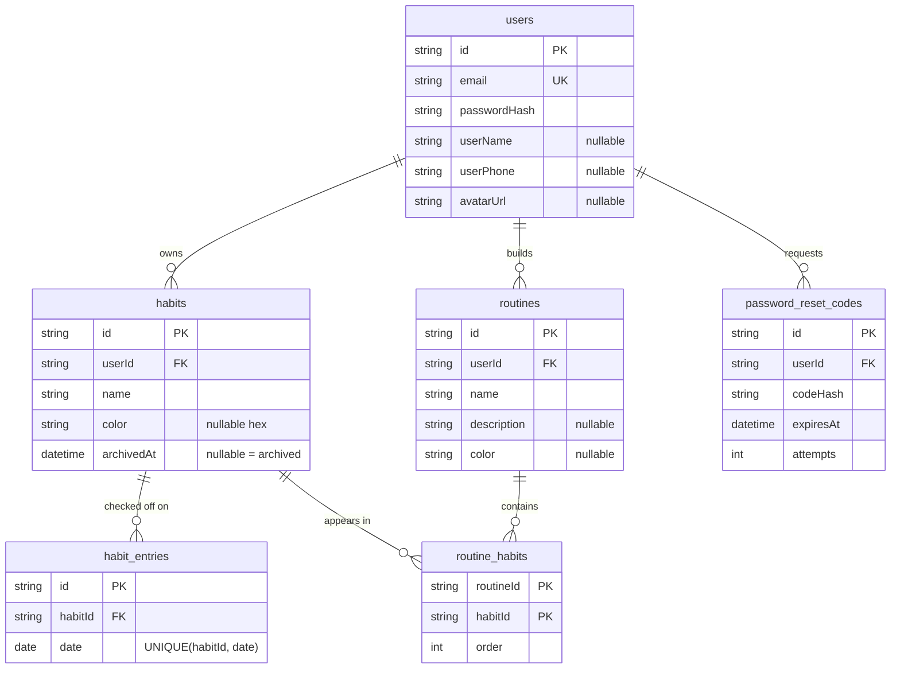

<div align="center">

# 🌱 Bloom

### Small habits. Daily taps. Streaks that grow.

A full-stack habit tracker: plant a few habits, check them off once a day, and watch your streaks bloom.


[Features](#-features) · [Quick start](#-quick-start) · [Architecture](#-under-the-hood) · [API](#-api) · [Testing](#-testing) · [Roadmap](#-whats-next)

</div>

---

## ✨ Why Bloom?

Bloom is a learning-first project that is built to be finished. It's a real app with real auth, a real database and real tests:

- 📱 **Flutter app** on clean architecture: domain → data → presentation, with dependencies pointing inward only.
- 🧠 **NestJS API** that owns every rule: auth, ownership checks and streak maths.
- 🐘 **PostgreSQL** behind Prisma, where one check-off is one row.

The app has no business logic of its own. It asks the server, shows the answer, and gets out of the way.

---

## 🌼 Features

| | Feature | What it does |
|---|---|---|
| 🔐 | **Accounts** | Email and password sign-up with JWT bearer auth. The token lives in encrypted storage and your session comes back on launch. |
| 🔑 | **Password reset** | A 6-digit code is emailed to you, exchanged for a short-lived reset token, then used to set a new password. Attempts are capped and requests throttled. |
| 🌱 | **Habits** | Create, rename, recolour, archive (history kept) or delete (history gone). |
| ✅ | **One-tap check-off** | Tap once per habit per day, tap again to undo. The row flips instantly and rolls back if the server says no. |
| 🔥 | **Streaks** | Computed server-side from entry rows and never stored, so there's nothing to drift out of sync. |
| 📊 | **Insights** | A 30-day window with your current and best perfect-day streak, daily completion and per-habit consistency. |
| 👤 | **Profile** | Your stats at a glance, plus an editable name, phone and avatar. |
| 🧘 | **Routines** *(UI preview)* | Group habits into a guided, timed routine and play it step by step: pause, skip, sound toggle and a celebration screen at the end. |
| 📡 | **Offline screen** | A friendly stop sign when the network drops, instead of a wall of errors. |

---

## 🚀 Quick start

> **You'll need:** Node.js 20+ with pnpm · PostgreSQL running locally · Flutter SDK (Dart `^3.11.5`) with an iOS simulator or Android emulator

### 1️⃣ Database

```bash
createdb habit_tracker
```

### 2️⃣ Backend

```bash
cd backend
pnpm install
cp .env.example .env              # fill in DATABASE_URL, JWT secrets and SMTP
pnpm prisma contract emit         # generate the client from prisma8/contract.prisma
pnpm run start:dev                # → http://localhost:3001
```

🧪 **Swagger UI** lives at **http://localhost:3001/api**. Paste a token into *Authorize* and you can call every endpoint from there.

<details>
<summary><b>backend/.env reference</b></summary>

| Variable | Purpose |
|---|---|
| `DATABASE_URL` | Postgres connection string for Prisma and the `pg` adapter |
| `JWT_SECRET` | Signing key for access tokens |
| `JWT_EXPIRES_IN` | Access token lifetime, e.g. `5d` |
| `JWT_RESET_SECRET` | Signing key for password-reset tokens. Keep it **different** from `JWT_SECRET` so a reset token can never pass as an access token. |
| `PORT` | API port (`3001` in the example) |
| `SMTP_HOST` / `SMTP_PORT` / `SMTP_SECURE` | Mail server. Mailtrap's sandbox works well in development. |
| `SMTP_USER` / `SMTP_PASS` | Mail credentials |
| `MAIL_FROM` | Sender, e.g. `Bloom <no-reply@bloom.app>` |

</details>

### 3️⃣ Mobile

```bash
cd mobile
flutter pub get
flutter run
```

The base URL works itself out: an Android emulator reaches your machine at `10.0.2.2:3001`, and everything else uses `localhost:3001`. If you're on a physical device or a deployed API, override it:

```bash
flutter run --dart-define=API_BASE_URL=http://192.168.1.20:3001
```

### 4️⃣ Plant your first habit 🌱

Sign up in the app, or straight from the terminal:

```bash
curl -X POST http://localhost:3001/auth/register \
  -H 'Content-Type: application/json' \
  -d '{"email":"you@example.com","password":"Password123"}'
```

---

## 🔧 Under the hood

```
┌──────────────────────────┐              ┌──────────────────────┐          ┌──────────────┐
│  Flutter app             │  HTTPS+JSON  │  NestJS API          │  Prisma  │  PostgreSQL  │
│  pages · Riverpod        │ ───────────▶ │  JWT guard           │ ───────▶ │  users       │
│  use cases · repos       │              │  DTO validation      │          │  habits      │
│  Dio + AuthInterceptor   │              │  streak computation  │          │  entries     │
│  secure token storage    │              │  error envelope      │          │  routines    │
└──────────────────────────┘              └──────────────────────┘          └──────────────┘
```

### ⚡ A single tap, all the way down



### 🧱 One shape for every feature

```
features/habits/
  domain/        entities · repository interfaces · use cases   ← pure Dart: no Flutter, no Dio
  data/          models · datasources · repository impls        ← implements domain
  presentation/  pages · providers · widgets                    ← reads domain via Riverpod
```

- Datasources throw `AppException`. Repositories translate it **once** into a sealed `Result<T>` that carries a `Failure`.
- Presentation code never writes `try`/`catch`. It `switch`es over `Success` / `ResultError`.
- All routing and redirects live in [app_router.dart](mobile/lib/app/router/app_router.dart), so no page decides for itself whether it may be shown.

📖 For the full sequence diagrams, redirect table and file map, see [docs/APP_FLOW.md](docs/APP_FLOW.md).

---

## 🗂 Repo layout

```
bloom_app/
├── backend/                 NestJS API
│   ├── src/auth/            register · login · me · password reset · JWT
│   ├── src/habit/           habit CRUD + streak decoration
│   ├── src/entries/         check-off, un-check, history range
│   ├── src/profile/         profile updates
│   ├── src/email/           SMTP mailer for reset codes
│   ├── src/routine/         routines (scaffold)
│   ├── src/utils/           computeCurrentStreak, date helpers
│   └── prisma8/             Prisma 8 contract (the schema)
├── mobile/                  Flutter app
│   ├── lib/app/             theme · router · tab shell
│   ├── lib/core/            network · storage · errors · shared widgets
│   ├── lib/features/        auth · habits · entries · insights · profile
│   │                        routines · onboarding · offline
│   └── test/                unit + widget tests
└── docs/                    design docs and app flow
```

---

## 🗄 Data model

A check-off is just a row in `habit_entries`, and un-checking deletes it. That's the whole trick.



🕰 **Time zones are handled deliberately.** Day keys are UTC on both sides, and date arithmetic works on calendar fields rather than adding 24-hour durations, so a DST switch can never repeat or skip a day. Every foreign key cascades on delete.

---

## 🔌 API

REST + JSON. Everything under `/habits` and `/profile` requires `Authorization: Bearer <token>` and is ownership-checked.

**Auth**

| Method | Path | Body | Notes |
|---|---|---|---|
| `POST` | `/auth/register` | `{ email, password }` | 409 if the email is taken |
| `POST` | `/auth/login` | `{ email, password }` | → `{ accessToken, user }` |
| `GET` | `/auth/me` | — | the current user |
| `POST` | `/auth/forgot-password` | `{ email }` | always returns the same message, so it never reveals whether an account exists · throttled |
| `POST` | `/auth/verify-reset-code` | `{ email, code }` | → short-lived `resetToken` · throttled, attempts capped |
| `POST` | `/auth/reset-password` | `{ resetToken, newPassword }` | no access token on purpose, so you sign in again |

**Habits, entries and profile**

| Method | Path | Body / Query | Notes |
|---|---|---|---|
| `POST` | `/habits` | `{ name, color? }` | `color` must be hex |
| `GET` | `/habits` | `?date=YYYY-MM-DD` | with a date, each row also carries `doneToday` + `currentStreak` |
| `PATCH` | `/habits/:id` | `{ name?, color?, archived? }` | `archived: true` stamps `archivedAt` |
| `DELETE` | `/habits/:id` | — | hard delete, cascades entries |
| `POST` | `/habits/:id/entries` | `{ date? }` | defaults to today; it's an upsert, so double taps do no harm |
| `GET` | `/habits/:id/entries` | `?from=&to=` | → `{ entries: Date[] }`, ascending |
| `DELETE` | `/habits/:id/entries/:date` | — | un-check that day |
| `PATCH` | `/profile` | `{ userName?, userPhone?, avatarUrl? }` | update your profile |

🔥 **Streaks** ([streak.ts](backend/src/utils/streak.ts)) are a pure function. Take the entry dates, build a set of `YYYY-MM-DD` keys and walk backwards one day at a time until you hit a gap.

🧯 **Errors** come back in one envelope, which the Dio client parses:

```json
{ "statusCode": 401, "isSuccess": false, "timestamp": "…",
  "path": "/auth/login", "error": "Invalid credentials" }
```

`error` is a string for most failures, and a list when DTO validation rejects the body.

---

## 🧪 Testing

```bash
cd backend && pnpm test          # auth, habits, entries, email, date helpers
cd mobile  && flutter test       # use cases, repositories, providers, widgets, responsive layouts
cd mobile  && flutter analyze    # static analysis
```

😈 **Hostile time zone mode.** Date bugs break quietly, so run both suites at the edges of the planet before you trust a change:

```bash
TZ=Pacific/Kiritimati pnpm test      # UTC+14
TZ=Pacific/Midway flutter test       # UTC-11
```

---

## 🚢 Deployment

| Target | How |
|---|---|
| 🧠 **Backend** | Dockerise it and deploy to Railway or Render with managed Postgres. Set the env vars above. |
| 🤖 **Android** | Generate a signing keystore, then run `flutter build apk --release --dart-define=API_BASE_URL=<prod URL>` |
| 🍎 **iOS** | Run `flutter build ipa --release --dart-define=API_BASE_URL=<prod URL>`, then ship through TestFlight |

> ⚠️ Never commit `.env` or the Android keystore.

---

## 🛣 What's next

**Still on the list**
- [ ] 🧘 **Routines backend.** The UI is built, but it runs on local state and `/routine` is still the Nest scaffold. The tables already exist.
- [ ] ⏰ **Reminders and notifications.** See [docs/notification-plan.md](docs/notification-plan.md).
- [ ] 💧 **Quantity habits** such as "2L of water", and custom schedules.
- [ ] 🔄 **Offline sync and social login.**

**Known gaps**
1. 📉 **Insights makes N+1 requests**: one for the habit list, then one per habit. That's fine at personal scale; a single aggregate endpoint would fix it.
2. 📚 **`GET /habits?date=` loads a habit's whole entry history** to compute its streak. It needs a bounded window before the data grows.
3. 🧩 **`pnpm test:e2e` doesn't run yet.** The e2e Jest config is missing the `src/*` path alias, and the spec is still the Nest scaffold.
4. 🚧 **The habit detail route is a placeholder**, and the Today quote is decoration with no data behind it.

---

## 📚 Docs

| Doc | What's inside |
|---|---|
| [APP_FLOW.md](docs/APP_FLOW.md) | How the app behaves end to end: sequence diagrams, redirect rules, and what's wired versus what isn't |
| [MVP design & build plan](docs/habit-tracker-mvp-design-and-build-plan.md) | The original design and phased plan |
| [Notification plan](docs/notification-plan.md) | Design notes for reminders |

<div align="center">

---

Made with 🌱 and a lot of `flutter test`

</div>
