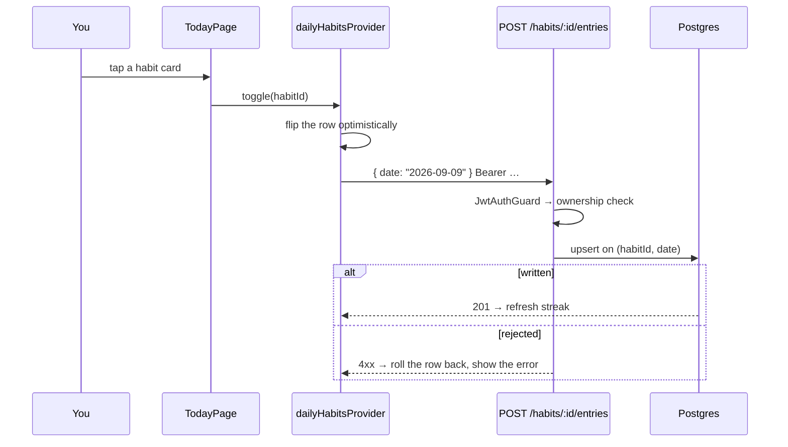
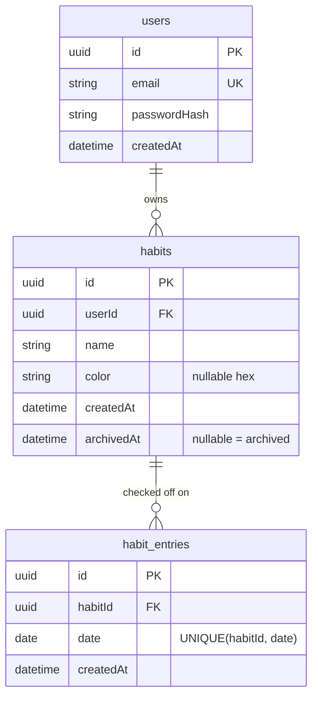

# Bloom

A daily habit tracker. Sign in, plant a few habits, check them off once a day, and watch the streaks grow. Built as a learning-first but finishable full-stack project: a Flutter app on clean architecture, a NestJS API that owns every rule, and PostgreSQL behind it.

**Stack:** Flutter 3.11 · Riverpod 3 · go_router 17 · Dio 5 — NestJS 11 · Prisma 7 · PostgreSQL · Passport-JWT

| Doc | What's in it |
|---|---|
| [docs/APP_FLOW.md](docs/APP_FLOW.md) | How the app behaves end to end — sequence diagrams, redirect rules, what is wired and what isn't |
| [docs/habit-tracker-mvp-design-and-build-plan.md](docs/habit-tracker-mvp-design-and-build-plan.md) | The original design and phased build plan |
| [docs/notification-plan.md](docs/notification-plan.md) | Design notes for reminders (not built yet) |

---

## Features

- **Email + password accounts.** JWT bearer auth, token kept in encrypted storage, session restored on launch.
- **Habits.** Create, rename, recolour, archive (keeps history) or delete (discards it).
- **Daily check-off.** One tap per habit per day; tap again to undo. The row flips immediately and rolls back if the server rejects it.
- **Streaks.** Computed server-side from the entry rows, never stored, so there is nothing to keep in sync.
- **Insights.** A 30-day window: perfect-day current and best streak, per-day completion, and per-habit consistency.
- **Profile.** Consistency, habit count and streak for the same window, plus sign-out.
- **Online-only.** The app holds no business logic beyond UI state; every read and write goes to the API.

**Not built:** reminders and notifications, quantity habits ("2L of water"), custom schedules, routines, offline sync, social login, password reset.

---

## How it operates

Three layers. The API owns auth, ownership checks and streak maths, and is the only thing that touches Postgres.

```
Flutter app (iOS / Android)  ──HTTPS + JSON──>  NestJS API  ──Prisma──>  PostgreSQL
  pages · Riverpod providers                     JWT guard                users
  use cases · repositories                       DTO validation           habits
  Dio client + AuthInterceptor                   streak computation       habit_entries
  secure token storage                           error envelope
```

**A check-off, all the way down:**



**Layering in the app.** Every feature folder repeats the same shape and dependencies point inward only:

```
features/habits/
  domain/       entities · repository interfaces · use cases   ← no Flutter, no Dio
  data/         models · datasources · repository impls        ← implements domain
  presentation/ pages · providers · widgets                    ← reads domain via Riverpod
```

Datasources throw `AppException`; repositories translate that once into a sealed `Result<T>` carrying a `Failure`. Presentation code never writes a `try`/`catch` — it `switch`es over `Success` / `ResultError`. Routing and redirects live in [app_router.dart](mobile/lib/app/router/app_router.dart), so no page decides whether it may be shown.

Full sequence diagrams, redirect table and file map: [docs/APP_FLOW.md](docs/APP_FLOW.md).

---

## Repo layout

```
bloom_app/
  backend/        NestJS + Prisma API
    src/auth/       register · login · me · JWT strategy and guard
    src/habit/      habit CRUD, streak decoration
    src/entries/    check-off, un-check, history range
    src/utils/      computeCurrentStreak, date helpers
    prisma/         schema + migrations
  mobile/         Flutter app
    lib/app/        theme · router · tab shell
    lib/core/       network · storage · errors · shared widgets
    lib/features/   auth · habits · entries · insights · profile
    test/          136 unit and widget tests
  docs/           design docs, app flow, screenshots
```

---

## Getting started

### Prerequisites

- Node.js 20+ and pnpm
- PostgreSQL running locally
- Flutter SDK (Dart `^3.11.5`) with an iOS simulator or Android emulator

### 1. Database

Create the database the API will use:

```bash
createdb habit
```

### 2. Backend

```bash
cd backend
pnpm install
cp .env.example .env          # then fill in DATABASE_URL and JWT_SECRET
pnpm prisma migrate dev       # apply the schema
pnpm run start:dev            # http://localhost:3000
```

Swagger UI is served at **http://localhost:3000/api** — every endpoint below is callable from there once you paste a token into *Authorize*.

**backend/.env**

| Variable | Purpose |
|---|---|
| `DATABASE_URL` | Postgres connection string used by Prisma and the `pg` adapter |
| `JWT_SECRET` | Signing key for access tokens |
| `JWT_EXPIRES_IN` | Token lifetime, e.g. `5d` |
| `PORT` | API port, defaults to `3000` |

### 3. Mobile

```bash
cd mobile
flutter pub get
flutter run
```

The base URL resolves itself: an Android emulator reaches the host on `http://10.0.2.2:3000`, everything else uses `http://localhost:3000`. Override it when you need to — a physical device on your LAN, or a deployed API:

```bash
flutter run --dart-define=API_BASE_URL=http://192.168.1.20:3000
```

### 4. Create an account

Register from the app's Sign Up screen, or straight against the API:

```bash
curl -X POST http://localhost:3000/auth/register \
  -H 'Content-Type: application/json' \
  -d '{"email":"you@example.com","password":"Password123"}'
```

---

## Data model

Three tables. A check-off is just a row in `habit_entries`; un-checking deletes it.



Both foreign keys cascade on delete. Day keys are UTC on both sides, and date arithmetic is done on calendar fields rather than by adding 24-hour durations, so a DST boundary cannot repeat or skip a day.

---

## API

REST + JSON. Everything under `/habits` requires `Authorization: Bearer <token>` and is ownership-checked.

| Method | Path | Body / Query | Behaviour |
|---|---|---|---|
| `POST` | `/auth/register` | `{ email, password }` | 409 if the email is taken |
| `POST` | `/auth/login` | `{ email, password }` | `{ accessToken, user }` |
| `GET` | `/auth/me` | — | the current user |
| `POST` | `/habits` | `{ name, color? }` | `color` must be a hex string |
| `GET` | `/habits` | `?date=YYYY-MM-DD` | active habits; with a date each row also carries `doneToday` and `currentStreak` |
| `PATCH` | `/habits/:id` | `{ name?, color?, archived? }` | `archived: true` stamps `archivedAt`, anything else clears it |
| `DELETE` | `/habits/:id` | — | hard delete, cascades entries |
| `POST` | `/habits/:id/entries` | `{ date? }` | defaults to today; upsert, so checking off twice is harmless |
| `GET` | `/habits/:id/entries` | `?from=&to=` | `{ entries: Date[] }`, ascending, both bounds required |
| `DELETE` | `/habits/:id/entries/:date` | — | un-check that day |

There is no refresh-token endpoint: one access token, and a 401 on a protected route drops it and sends you back to sign-in.

**Streaks** ([`utils/streak.ts`](backend/src/utils/streak.ts)) are pure: take the habit's entry dates and a target day, build a set of `YYYY-MM-DD` keys, walk backwards a day at a time until a gap.

**Errors** are normalised by a global filter into one envelope, which the Dio client parses back:

```json
{ "statusCode": 401, "isSuccess": false, "timestamp": "…",
  "path": "/auth/login", "error": "Invalid credentials" }
```

`error` is a string for most failures and a list when DTO validation rejects the body.

---

## Testing

```bash
cd backend && pnpm test        # 18 tests, 4 suites — auth, habits, entries, date helpers
cd mobile  && flutter test     # 136 tests — use cases, repositories, providers, widgets
cd mobile  && flutter analyze  # static analysis
```

Date handling is the part that breaks quietly, so it is worth running both suites under a hostile timezone before trusting a change:

```bash
TZ=Pacific/Kiritimati pnpm test      # UTC+14
TZ=Pacific/Midway flutter test       # UTC-11
```

---

## Deployment

- **Backend** — Dockerise and deploy to Railway or Render with managed Postgres. Set the env vars above and run `prisma migrate deploy` on release.
- **Android** — generate a signing keystore, then `flutter build apk --release --dart-define=API_BASE_URL=<prod URL>`.
- **iOS** — `flutter build ipa --release --dart-define=API_BASE_URL=<prod URL>`, then distribute through TestFlight.

Never commit `.env` or the Android keystore.

---

## Known gaps

1. **Forgot Password has no backend.** The OTP screen accepts any four digits after a fixed delay; there is no `/auth/forgot-password` route.
2. **Insights costs N+1 requests** — one for the habit list, then one per habit for its entries. Fine at personal scale; the fix is a single aggregate endpoint.
3. **`GET /habits?date=` loads a habit's whole entry history** to compute its streak. It needs a bounded window before the data grows.
4. **`pnpm test:e2e` does not run.** The e2e Jest config is missing the `src/*` path alias mapping that the unit config has, and the spec itself is still the Nest scaffold rather than a register → check-off → streak happy path.
5. **The habit detail route is a placeholder**, and the Today quote is decoration with no data behind it.
