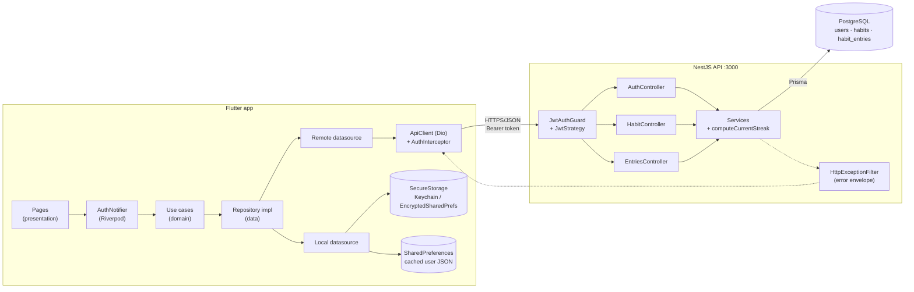
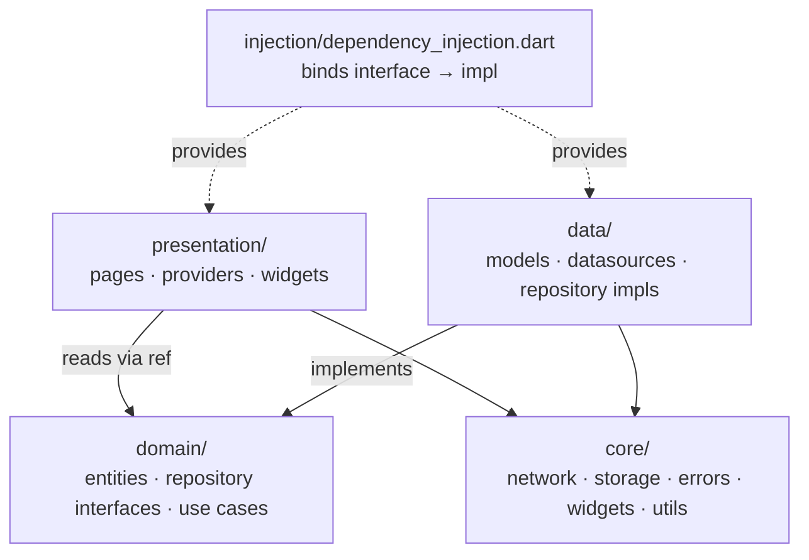
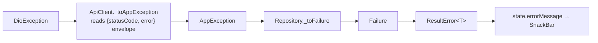
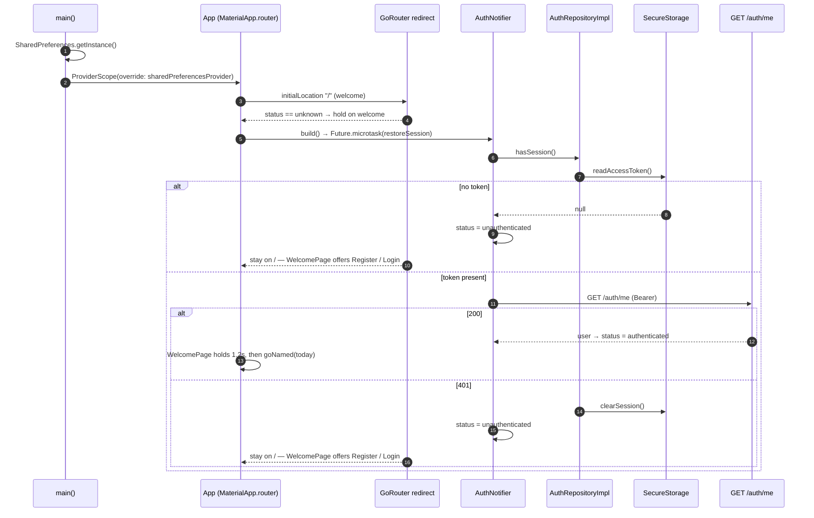
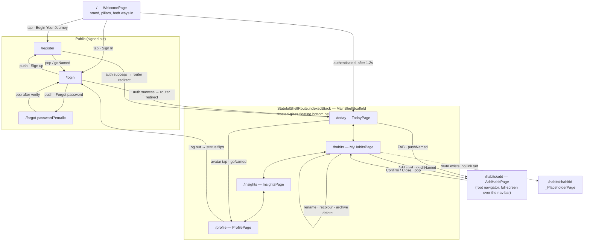
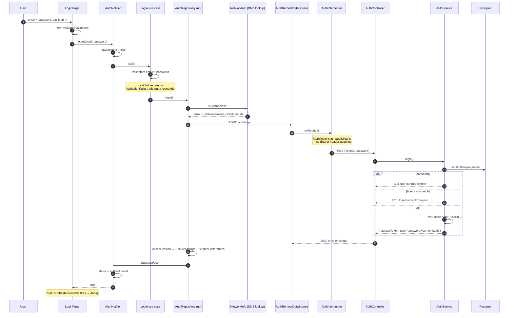
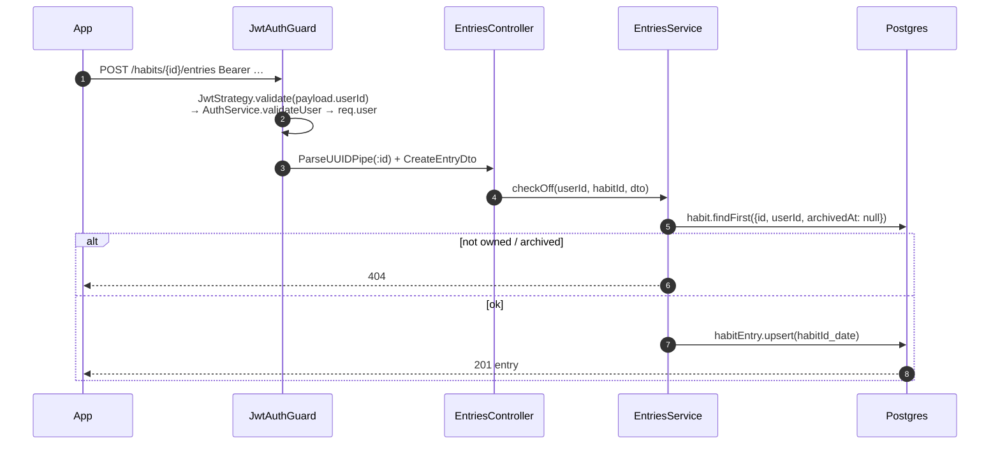
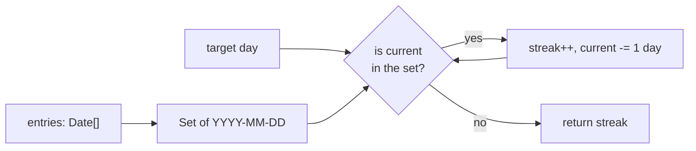
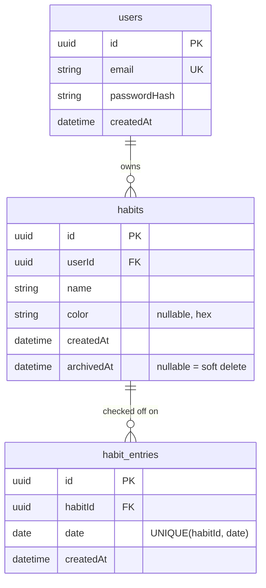
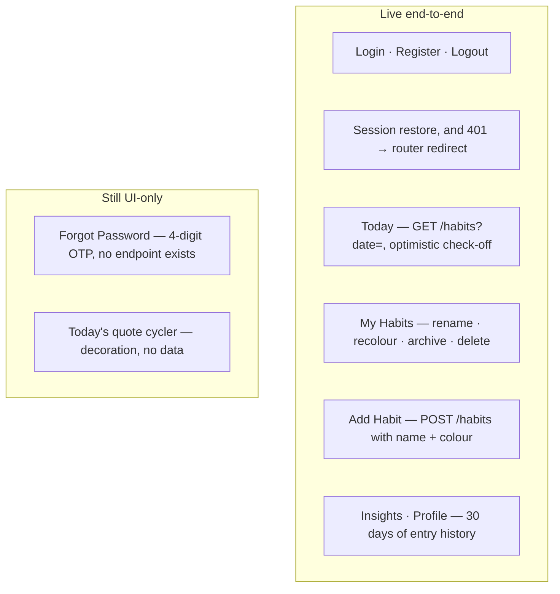

# Bloom — Full-Stack App Flow

A walkthrough of how the app actually behaves today: what the user touches, what
crosses the wire, and where the wiring stops. Written from a read of
`backend/src`, `backend/prisma`, and `mobile/lib` on the `staging` branch.

- **Mobile:** Flutter 3.11 · Riverpod 3 · go_router 17 · Dio 5 · flutter_secure_storage
- **Backend:** NestJS · Prisma · PostgreSQL · Passport-JWT · Swagger at `/api`
- **Shape:** online-only. The app holds no business logic beyond UI state; the API owns auth, ownership, and streaks.

---

## 1. System overview



**Base URL resolution** (`core/constants/api_constants.dart`): `--dart-define=API_BASE_URL` wins;
otherwise Android emulator → `http://10.0.2.2:3000`, everything else → `http://localhost:3000`.

---

## 2. Clean-architecture layering (mobile)

Every feature folder repeats the same four-layer shape. Dependencies point inward
only; the DI file is the single place that knows concrete classes.



**Error translation happens exactly once.** Datasources throw `AppException`
(`ServerException`, `NetworkException`, `UnauthorizedException`,
`ValidationException`, `NotFoundException`, `CacheException`). The repository
catches them and returns a sealed `Result<T>` carrying a `Failure`. Presentation
code never sees a `try`/`catch` — it `switch`es over `Success` / `ResultError`.



---

## 3. Startup and session restore



The router is rebuilt from a `ValueNotifier<AuthStatus>` fed by
`ref.listen(authNotifierProvider.select(...))`, so **no page ever decides
whether it may be shown** — `redirect` in `app_router.dart` does.

Redirect rules:

| Status | Location | Result |
|---|---|---|
| `unknown` | anything but `/` | → `/` (welcome) |
| `unauthenticated` | public path (`/`, `/login`, `/register`, `/forgot-password`) | stay |
| `unauthenticated` | anything else | → `/login` |
| `authenticated` | `/` (welcome) | stay — the page moves the user on itself |
| `authenticated` | any other public path | → `/today` |
| `authenticated` | private path | stay |

`/` is the one route every launch passes through, signed in or out. The
redirect deliberately does **not** bounce an authenticated user off it;
`WelcomePage` waits out a 1.2s brand beat and then calls
`goNamed(today)` itself, which is what keeps the screen from flashing
past a returning user.

---

## 4. Screen flow



Tab state is preserved per branch (`indexedStack`); tapping the active tab
re-navigates to that branch's initial location.

---

## 5. Auth: login and register end to end



Register follows the same path against `POST /auth/register`
(409 on a duplicate email) and additionally checks `confirmPassword` client-side,
since the backend DTO has no such field.

**Token handling:** `AuthInterceptor` attaches
`Authorization: Bearer <token>` to every request whose path is not
`/auth/login` or `/auth/register`. On a 401/403 from a *non-public* path it
deletes the token — a 401 on login means "wrong password", not "expired
session", so the stored token is left alone there.

---

## 6. Habits and entries (backend contract)

All `/habits/**` routes sit behind `@UseGuards(JwtAuthGuard)` and resolve the
caller through the `@CurrentUser('id')` param decorator.

| Method | Path | Body / Query | Behaviour |
|---|---|---|---|
| `POST` | `/habits` | `{ name, color? }` (`color` must be hex) | creates for the current user |
| `GET` | `/habits` | `?date=YYYY-MM-DD` | active habits (`archivedAt: null`); with a date, each row is decorated with `doneToday` + `currentStreak` |
| `PATCH` | `/habits/:id` | `{ name?, color?, archived? }` | ownership-checked; `archived: true` stamps `archivedAt`, anything else clears it |
| `DELETE` | `/habits/:id` | — | ownership-checked hard delete (cascades entries) |
| `POST` | `/habits/:id/entries` | `{ date? }`, defaults to today | `upsert` on `@@unique([habitId, date])` — idempotent check-off |
| `GET` | `/habits/:id/entries` | `?from=&to=` | ownership-checked; returns `{ entries: Date[] }` ascending |
| `DELETE` | `/habits/:id/entries/:date` | — | un-check a day |

### Check-off round trip



### Streak computation

`computeCurrentStreak` (`backend/src/utils/streak.ts`) is pure: it takes the
habit's entry dates plus a target day, builds a `Set` of `YYYY-MM-DD` strings,
and walks backwards one day at a time until a gap.



Streaks are **never stored** — there is nothing to keep in sync. Un-checking a
day is a row delete, and the next read recomputes.

### Error envelope

`HttpExceptionFilter` normalises every `HttpException` into a single shape, which
`ApiClient._parseErrorBody` reads back on the client:

```json
{ "statusCode": 401, "isSuccess": false, "timestamp": "…",
  "path": "/auth/login", "error": "Invalid credentials" }
```

`error` is a string for most failures and a **list** when class-validator rejects
a DTO — the client keeps the list as `ValidationFailure.errors` and shows the
first message.

---

## 7. Data model



Both FKs are `onDelete: Cascade`. A check-off is just a row; archiving keeps
history, deleting discards it.

---

## 8. What is wired

Every screen now reads and writes the real API. The Stitch mockups that had no
schema behind them were fitted to the contract rather than faked.



Concretely:

- **Today** shows the real habit list. The ring is done/total, the badge is the
  highest `currentStreak`, and tapping a card posts or deletes an entry
  optimistically — the row flips first and rolls back if the write is rejected.
- **My Habits** replaced the Routines mockup. Routines were three hardcoded
  cards with no table behind them, while `PATCH` and `DELETE /habits/:id` had no
  caller anywhere in the app; the tab now uses both.
- **Add Habit** posts `{ name, color }`. The goal, frequency and reminder-time
  controls are gone: the schema stores none of them.
- **Insights and Profile** compute from history. There is no aggregate endpoint,
  so `insightsProvider` fetches `GET /habits` once and then each habit's entries
  in parallel over a 30-day window, and a pure `InsightsCalculator` turns that
  into streaks, per-day completion and per-habit rates.
- **Dropped rather than faked:** the water-quantity habit, routines as a stored
  concept, schedules and reminders, and the hardcoded 88% / 14 / 28 stat row.
  None of them had anywhere to live.

Extending the schema for quantity habits, routines and schedules is a separate
piece of work, specified nowhere yet.

## 9. Remaining rough edges

The six defects this document previously listed here — the register token claim,
the unbound `date` query DTO, the mis-keyed entry delete, the module-load
`TODAY`, the row-spreading `updateHabits`, and the unsupplied
`AuthInterceptor.onUnauthorized` — are fixed and covered by tests. What is left:

1. **`ForgotPasswordPage` has no backend.** There is no `/auth/forgot-password`
   or `/auth/reset-password` on the server; the OTP screen verifies any 4 digits
   after a fixed delay.

2. **`GET /habits?date=` loads a habit's whole entry history** to compute its
   streak. Fine at personal scale, but it needs a bounded window before the data
   grows.

3. **Insights costs N+1 requests** — one for the habit list, then one per habit
   for its entries. Acceptable for now, and the obvious fix is a single
   aggregate endpoint on the server.

4. **Day keys are UTC on both sides.** `HabitEntry.date` is written at UTC
   midnight and read back in UTC; the client's `AppDateUtils` does calendar
   arithmetic rather than adding 24-hour `Duration`s. Both suites are run under
   `Pacific/Kiritimati`, `Pacific/Midway` and `America/Santiago` because every
   one of those rules was broken until a test in one of those zones caught it.

## 10. File map

| Concern | Path |
|---|---|
| App entry / bootstrap | [mobile/lib/main.dart](../mobile/lib/main.dart) |
| Routing + redirects | [mobile/lib/app/router/app_router.dart](../mobile/lib/app/router/app_router.dart) |
| Route constants | [mobile/lib/app/router/route_names.dart](../mobile/lib/app/router/route_names.dart) |
| First screen every launch | [mobile/lib/features/onboarding/presentation/pages/welcome_page.dart](../mobile/lib/features/onboarding/presentation/pages/welcome_page.dart) |
| Habit state + optimistic toggle | [mobile/lib/features/habits/presentation/providers/daily_habits_provider.dart](../mobile/lib/features/habits/presentation/providers/daily_habits_provider.dart) |
| History maths (pure) | [mobile/lib/features/insights/domain/insights_calculator.dart](../mobile/lib/features/insights/domain/insights_calculator.dart) |
| Tab shell / bottom nav | [mobile/lib/app/shell/main_shell_scaffold.dart](../mobile/lib/app/shell/main_shell_scaffold.dart) |
| Object graph | [mobile/lib/injection/dependency_injection.dart](../mobile/lib/injection/dependency_injection.dart) |
| Auth state machine | [mobile/lib/features/auth/presentation/providers/auth_provider.dart](../mobile/lib/features/auth/presentation/providers/auth_provider.dart) |
| Exception → Failure | [mobile/lib/features/auth/data/repositories/auth_repository_impl.dart](../mobile/lib/features/auth/data/repositories/auth_repository_impl.dart) |
| HTTP client | [mobile/lib/core/network/api_client.dart](../mobile/lib/core/network/api_client.dart) |
| Token attach / clear | [mobile/lib/core/network/interceptors/auth_interceptor.dart](../mobile/lib/core/network/interceptors/auth_interceptor.dart) |
| Endpoint constants | [mobile/lib/core/constants/api_constants.dart](../mobile/lib/core/constants/api_constants.dart) |
| Auth endpoints | [backend/src/auth/auth.controller.ts](../backend/src/auth/auth.controller.ts) |
| Habit endpoints | [backend/src/habit/habit.controller.ts](../backend/src/habit/habit.controller.ts) |
| Entry endpoints | [backend/src/entries/entries.controller.ts](../backend/src/entries/entries.controller.ts) |
| Streak rule | [backend/src/utils/streak.ts](../backend/src/utils/streak.ts) |
| Error envelope | [backend/src/common/filters/all-exceptions.filter.ts](../backend/src/common/filters/all-exceptions.filter.ts) |
| Schema (Prisma 8 contract) | [backend/prisma8/contract.prisma](../backend/prisma8/contract.prisma) |
